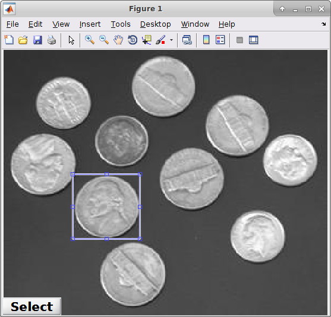
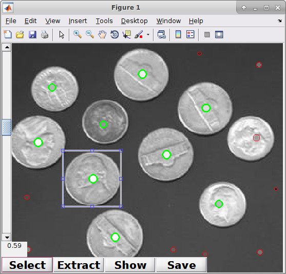
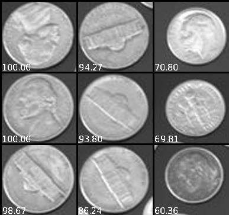

sample_generator
===========
Semi-automatic patch extraction via NXCC-based template matching.

# Description
Initially, the user manually selects a template. Further samples similar to the
selected patch are suggested by looking for local maxima from the normalized
cross correlation (NXCC) map between the input and the template. Sample center
positions can be manually moved (left click) and selected / unselected (right
click) before extraction. Samples are assigned to two classes (positive /
negative) based on the peak value in the NXCC map. The threshold for the
assignment can be chosen interactively. Samples too close to the image borders
are excluded since they could not be cropped at the desired resolution.
When exporting, samples can be assigned a specific predefined class type.

# Example:
## template selection

## auto detection with controls

## extracted patches with NXCC scores

# How to run?
git clone --recurse-submodules https://github.com/smrzbach/sample_generator.git

Place your input images into the folder **sample_images**.
An example script is provided in [sample_selection.m](./sample_selection.m)
